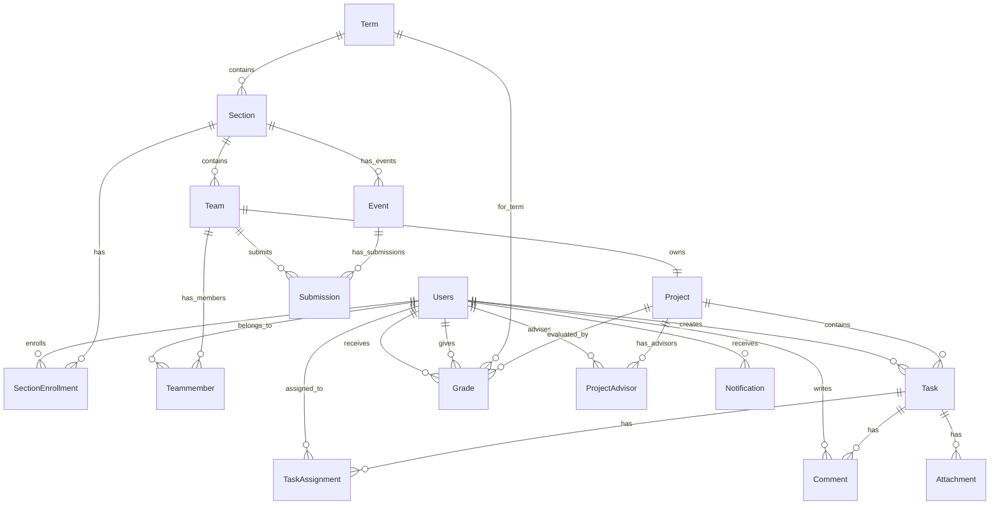

# 🗄️ Database Architecture

> Schema, Models, และ Relationships (Updated: 2026-02-25)

---

## 📊 Entity Relationship Diagram



---

## 📋 Core Models

| Model              | Purpose        | Key Fields                                  |
| ------------------ | -------------- | ------------------------------------------- |
| **Users**          | ผู้ใช้ทั้งหมด  | `users_id`, `role`, `email`                 |
| **Term**           | ภาคการศึกษา    | `academicYear`, `semester`                  |
| **Section**        | หมู่เรียน      | `section_code`, `course_type`, `study_type` |
| **Team**           | ทีมโครงงาน     | `name`, `groupNumber`, `section_id`         |
| **Project**        | โครงงาน        | `projectname`, `status`, `team_id`          |
| **Task**           | งานย่อย        | `title`, `status`, `priority`               |
| **Grade**          | การประเมิน     | `student_id`, `evaluator_id`, `score`       |
| **Event**          | กิจกรรม/ส่งงาน | `name`, `type`, `dueDate`, `section_id`     |
| **Submission**     | การส่งงาน      | `event_id`, `team_id`, `status`             |
| **Notification**   | การแจ้งเตือน   | `user_id`, `message`, `event_type`          |
| **Attachment**     | ไฟล์แนบ        | `task_id`, `filename`, `url`                |

---

## 🏷️ Enums Definition

```prisma
// บทบาทผู้ใช้
enum Role {
  ADMIN     // ผู้ดูแลระบบ
  ADVISOR   // อาจารย์ที่ปรึกษา
  STUDENT   // นักศึกษา
}

// ประเภทรายวิชา
enum CourseType {
  PRE_PROJECT   // วิชา Pre-Project
  PROJECT       // วิชา Project
}

// ประเภทการศึกษา
enum StudyType {
  REG   // ปกติ 4 ปี
  LE    // เทียบโอน ปวส.
}

// สถานะโครงงาน
enum ProjectStatus {
  DRAFT      // ร่าง
  PENDING    // รอการอนุมัติ
  APPROVED   // อนุมัติแล้ว
  REJECTED   // ไม่อนุมัติ
}

// สถานะ Task
enum TaskStatus {
  TODO          // ต้องทำ
  IN_PROGRESS   // กำลังดำเนินการ
  IN_REVIEW     // อยู่ระหว่างตรวจสอบ
  DONE          // สำเร็จ
}

// ความสำคัญ Task
enum TaskPriority {
  LOW
  MEDIUM
  HIGH
}

// ประเภท Event
enum EventType {
  PROGRESS_REPORT  // รายงานความก้าวหน้า
  DOCUMENT         // เอกสาร (ขอสอบ, TOR)
  POSTER           // โปสเตอร์
  EXAM             // สอบ
  FINAL_SUBMISSION // ส่งฉบับสมบูรณ์
  SEMINAR          // สัมมนา
}

// สถานะการส่งงาน
enum SubmissionStatus {
  PENDING          // ยังไม่ส่ง
  SUBMITTED        // ส่งแล้ว รอตรวจ
  NEEDS_REVISION   // ต้องแก้ไข
  APPROVED         // ผ่านแล้ว
}

// เกรดประเมินผล
enum GradeScore {
  A        // เกรด A
  B_PLUS   // เกรด B+
  B        // เกรด B
  C_PLUS   // เกรด C+
  C        // เกรด C
  D_PLUS   // เกรด D+
  D        // เกรด D
  F        // เกรด F
}
```

---

## 🔗 Key Relationships Rules

| Rule                    | Description                                             |
| ----------------------- | ------------------------------------------------------- |
| **1 Team = 1 Project**  | ทีมหนึ่งมีโครงงานได้หนึ่งโครงงาน (`@unique` on team_id) |
| **Student per Section** | นักศึกษาอยู่ได้ 1 ทีม ต่อ 1 Section                     |
| **Multi-Advisor**       | โครงงานมีอาจารย์ที่ปรึกษาได้หลายคน                      |
| **Multi-Evaluator**     | การให้เกรดมีผู้ประเมินได้หลายคน                         |
| **Event per Section**   | แต่ละ section มีหลาย event ได้                           |
| **Advisor Limit**       | อาจารย์รับโปรเจกต์ approved ได้สูงสุด 2                  |

---

## 📄 Model Details

### Users

```prisma
model Users {
  users_id       String  @id @db.VarChar(13)
  passwordHash   String? @db.VarChar(255)
  titles         String? @db.VarChar(20)
  firstname      String? @db.VarChar(50)
  lastname       String? @db.VarChar(50)
  tel_number     String? @db.VarChar(10)
  email          String? @unique @db.VarChar(100)
  profilePicture String?
  role           Role    @default(STUDENT)
}
```

### Section

```prisma
model Section {
  section_id       Int        @id @default(autoincrement())
  section_code     String
  course_type      CourseType
  study_type       StudyType
  min_team_size    Int
  max_team_size    Int
  team_deadline    DateTime
  team_locked      Boolean    @default(false)
  term_id          Int
}
```

### Team & Project

```prisma
model Team {
  team_id     Int     @id @default(autoincrement())
  name        String? @db.VarChar(255)
  groupNumber String?
  semester    String?
  status      String?
  section_id  Int
}

model Project {
  project_id     Int           @id @default(autoincrement())
  projectname    String        @db.VarChar(100)
  projectnameEng String?      @db.VarChar(100)
  description    String?
  project_type   String?
  status         ProjectStatus @default(DRAFT)
  team_id        Int           @unique
  createdAt      DateTime      @default(now())
}
```

### Event & Submission

```prisma
model Event {
  event_id    Int       @id @default(autoincrement())
  name        String    @db.VarChar(100)
  type        EventType
  description String?
  order       Int
  dueDate     DateTime
  section_id  Int
  createdAt   DateTime  @default(now())
}

model Submission {
  submission_id Int              @id @default(autoincrement())
  event_id      Int
  team_id       Int
  status        SubmissionStatus @default(PENDING)
  submittedAt   DateTime?
  file          String?
  feedback      String?
  approvedAt    DateTime?
  approvedBy    String?          @db.VarChar(13)
  createdAt     DateTime         @default(now())
}
```

### Relationships

```
Users 1:N SectionEnrollment N:1 Section 1:N Team
Team 1:N Teammember N:1 Users
Team 1:1 Project
Team 1:N Submission N:1 Event N:1 Section
Project 1:N Task 1:N TaskAssignment N:1 Users
Project N:M ProjectAdvisor (Users as Advisor)
Users 1:N Grade (as Student)
Users 1:N Grade (as Evaluator)
```

---

> **Last Updated:** 2026-02-19
