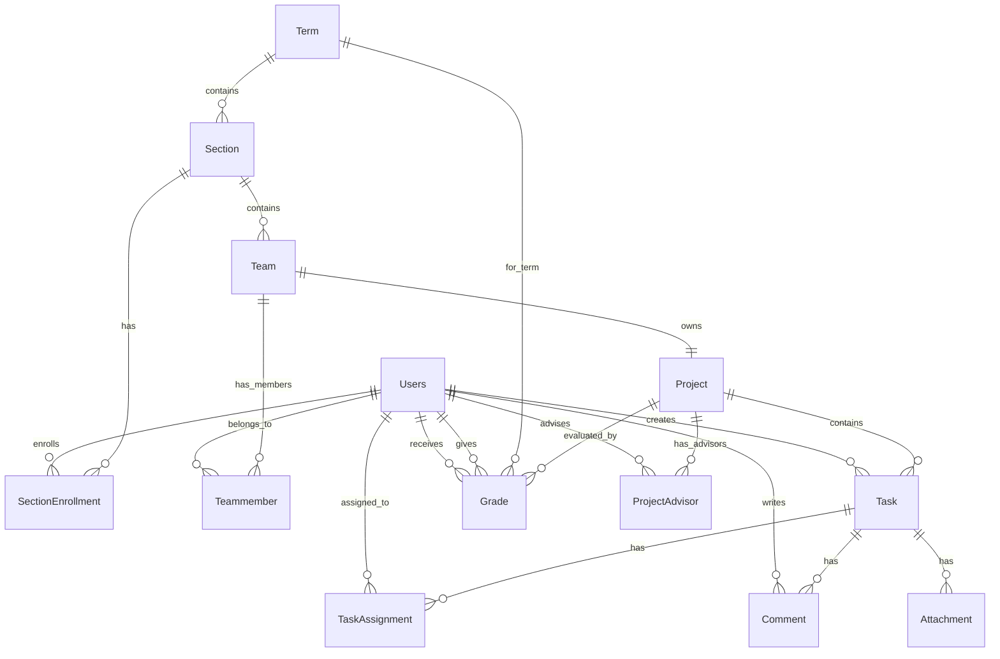

# 🗄️ Database Architecture

> Schema, Models, และ Relationships

---

## 📊 Entity Relationship Diagram



---

## 📋 Core Models

| Model            | Purpose       | Key Fields                                  |
| ---------------- | ------------- | ------------------------------------------- |
| **Users**        | ผู้ใช้ทั้งหมด | `users_id`, `role`, `email`                 |
| **Term**         | ภาคการศึกษา   | `academicYear`, `semester`                  |
| **Section**      | หมู่เรียน     | `section_code`, `course_type`, `study_type` |
| **Team**         | ทีมโครงงาน    | `teamname`, `section_id`                    |
| **Project**      | โครงงาน       | `projectname`, `status`, `team_id`          |
| **Task**         | งานย่อย       | `title`, `status`, `priority`               |
| **Grade**        | การประเมิน    | `student_id`, `evaluator_id`, `score`       |
| **Notification** | การแจ้งเตือน  | `user_id`, `message`, `event_type`          |

---

## 🏷️ Enums Definition

```prisma
// บทบาทผู้ใช้
enum Role {
  ADMIN     // ผู้ดูแลระบบ
  ADVISOR   // อาจารย์ที่ปรึกษา
  STUDENT   // นักศึกษา
}

// ประเภทรายวิชา
enum CourseType {
  PRE_PROJECT   // วิชา Pre-Project
  PROJECT       // วิชา Project
}

// ประเภทการศึกษา
enum StudyType {
  REG   // ปกติ 4 ปี
  LE    // เทียบโอน ปวส.
}

// สถานะโครงงาน
enum ProjectStatus {
  DRAFT      // ร่าง
  PENDING    // รอการอนุมัติ
  APPROVED   // อนุมัติแล้ว
  REJECTED   // ไม่อนุมัติ
}

// เกรดประเมินผล
enum GradeScore {
  A, A_PLUS, B, B_PLUS, C, C_PLUS, D, D_PLUS
}
```

---

## 🔗 Key Relationships Rules

| Rule                    | Description                                             |
| ----------------------- | ------------------------------------------------------- |
| **1 Team = 1 Project**  | ทีมหนึ่งมีโครงงานได้หนึ่งโครงงาน (`@unique` on team_id) |
| **Student per Section** | นักศึกษาอยู่ได้ 1 ทีม ต่อ 1 Section                     |
| **Multi-Advisor**       | โครงงานมีอาจารย์ที่ปรึกษาได้หลายคน                      |
| **Multi-Evaluator**     | การให้เกรดมีผู้ประเมินได้หลายคน                         |

---

## 📄 Model Details

### Users

```prisma
model Users {
  users_id       String  @id @db.VarChar(13)
  passwordHash   String? @db.VarChar(255)
  titles         String? @db.VarChar(20)
  firstname      String? @db.VarChar(50)
  lastname       String? @db.VarChar(50)
  tel_number     String? @db.VarChar(10)
  email          String? @unique @db.VarChar(100)
  profilePicture String?
  role           Role    @default(STUDENT)
}
```

### Section

```prisma
model Section {
  section_id       Int        @id @default(autoincrement())
  section_code     String
  course_type      CourseType
  study_type       StudyType
  min_team_size    Int
  max_team_size    Int
  project_deadline DateTime
  team_deadline    DateTime
  term_id          Int
}
```

### Team & Project

```prisma
model Team {
  team_id    Int    @id @default(autoincrement())
  teamname   String @db.VarChar(255)
  section_id Int
}

model Project {
  project_id     Int           @id @default(autoincrement())
  projectname    String        @db.VarChar(100)
  projectnameEng String?       @db.VarChar(100)
  description    String?
  project_type   String?
  status         ProjectStatus @default(DRAFT)
  team_id        Int           @unique
}
```
