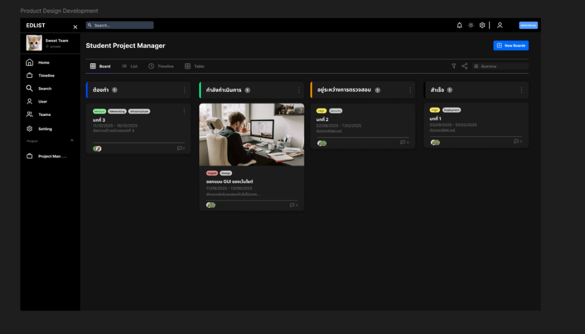

# 📋 Task Management Implementation Plan

> **Version:** 1.0
> **Created:** 2026-01-28
> **Status:** Planning

---

## 🎨 UI Reference



---

## 🎯 Requirements Summary (จากผู้ใช้)

| Requirement            | Description                                                   |
| ---------------------- | ------------------------------------------------------------- |
| **เข้าถึงจาก Sidebar** | อยู่ใต้ Project section ด้านซ้ายมือ                           |
| **Access Control**     | เปิดใช้งานได้เมื่อ Advisor อนุมัติหัวข้อ Project แล้ว         |
| **Kanban Board**       | 4 คอลัมน์: ต้องทำ, กำลังดำเนินการ, อยู่ระหว่างตรวจสอบ, สำเร็จ |
| **View Options**       | Board และ Timeline (Gantt Chart) - **ไม่ต้องการ List/Table**  |
| **Task Card**          | แสดง Tags, วันที่, รายละเอียด, Assignee, Comment count        |
| **Task Detail**        | กดดูรายละเอียด Task + Comment ได้                             |
| **Create Task**        | ปุ่ม "New Board" (New Task) ขวาบน                             |
| **Assignment**         | มอบหมายงานให้สมาชิกในกลุ่มได้                                 |

---

## 🏗️ Technical Implementation

### 1. API Routes ที่ต้องสร้าง

```
src/app/api/tasks/
├── route.ts              # GET (list), POST (create)
├── [id]/
│   ├── route.ts          # GET, PUT, DELETE
│   ├── assign/route.ts   # POST (assign), DELETE (unassign)
│   └── comments/route.ts # GET, POST comments
```

### 2. Components ที่ต้องสร้าง

```
src/modules/task/
├── components/
│   ├── TaskBoard.tsx         # Kanban Board
│   ├── TaskColumn.tsx        # คอลัมน์
│   ├── TaskCard.tsx          # Card แสดง Task
│   ├── TaskDetailModal.tsx   # รายละเอียด + Comments
│   ├── TaskFormModal.tsx     # สร้าง/แก้ไข Task
│   ├── TaskGanttChart.tsx    # Gantt Chart
│   └── TaskComments.tsx      # Comments
├── hooks/
│   └── useTaskBoard.ts
├── services/
│   └── taskService.ts
└── types/
    └── task.types.ts
```

### 3. Task Statuses (4 คอลัมน์)

| Status        | Thai                  | Color     |
| ------------- | --------------------- | --------- |
| `TODO`        | ต้องทำ                | 🟡 Yellow |
| `IN_PROGRESS` | กำลังดำเนินการ        | 🟢 Green  |
| `IN_REVIEW`   | อยู่ระหว่างการตรวจสอบ | 🟢 Green  |
| `DONE`        | สำเร็จ                | 🟢 Green  |

---

## 📋 Implementation Checklist

### Phase 2.1: Task API (2 วัน)

- [ ] `/api/tasks/route.ts` (GET, POST)
- [ ] `/api/tasks/[id]/route.ts` (GET, PUT, DELETE)
- [ ] `/api/tasks/[id]/assign/route.ts`
- [ ] `/api/tasks/[id]/comments/route.ts`

### Phase 2.2: Task Components (3 วัน)

- [ ] `TaskBoard.tsx` (Kanban)
- [ ] `TaskColumn.tsx`
- [ ] `TaskCard.tsx`
- [ ] `TaskDetailModal.tsx`
- [ ] `TaskFormModal.tsx`
- [ ] `TaskComments.tsx`

### Phase 2.3: Gantt Chart (2 วัน)

- [ ] `TaskGanttChart.tsx`
- [ ] View Switcher (Board / Timeline)

### Phase 2.4: Integration (1 วัน)

- [ ] เพิ่มใน StudentSidebar
- [ ] สร้างหน้า `/tasks`
- [ ] Test end-to-end

---

## ⏱️ Estimated Timeline

| Phase     | Days  | Description              |
| --------- | ----- | ------------------------ |
| 2.1       | 2     | Task API                 |
| 2.2       | 3     | Components               |
| 2.3       | 2     | Gantt Chart              |
| 2.4       | 1     | Integration              |
| **Total** | **8** | **Full Task Management** |

---

## 🔗 Dependencies

```bash
# Drag & Drop
npm install @dnd-kit/core @dnd-kit/sortable

# Gantt Chart
npm install gantt-task-react
```

---

## 🏗️ Architecture Update: Route Structure (Refactoring Result)

**Date:** 2026-01-28

Refactor Route เรียบร้อยครับ!

สรุปโครงสร้างใหม่ (Clean & Safe):

### 1. Student (`/tasks`)

- **Path:** `src/app/(student)/tasks/page.tsx`
- **Context:** ดึงข้อมูลจากทีมของผู้ใช้เองอัตโนมัติ
- **UI:** Student Layout + Student Sidebar

### 2. Advisor (`/advisor-tasks`)

- **Path:** `src/app/(advisor)/advisor-tasks/page.tsx`
- **Context:** รับ `?project={id}` จาก URL
- **UI:** Advisor Layout + Advisor Sidebar (ลิงก์อัปเดตแล้ว)
